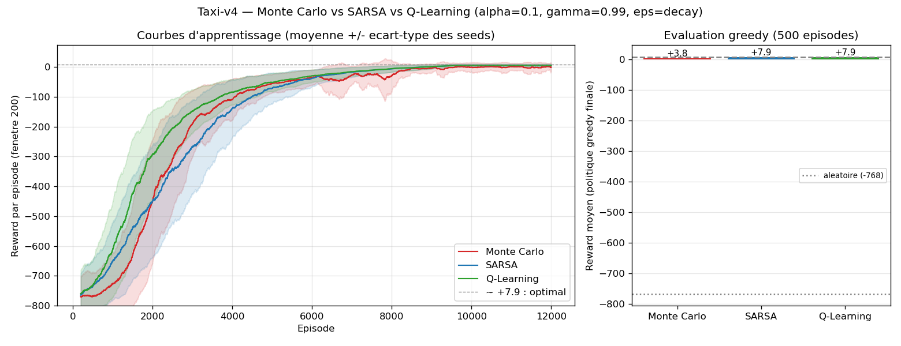
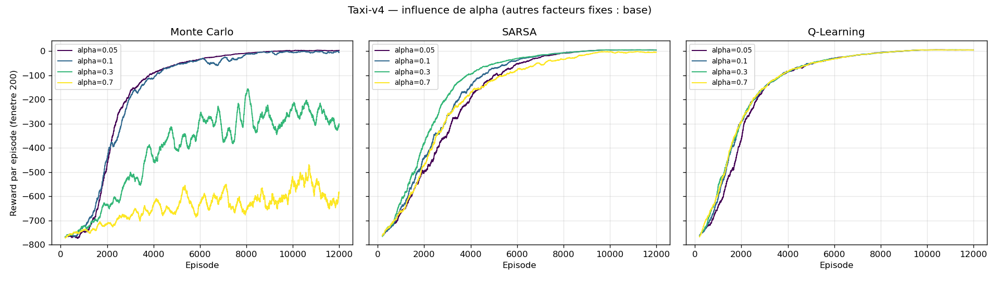
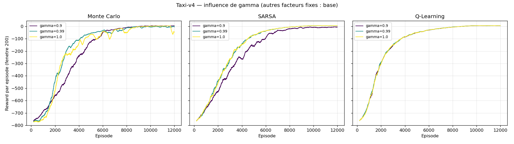
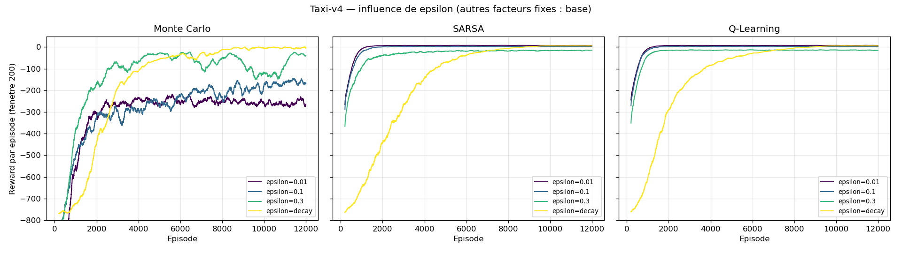

# Rapport de résultats — MC vs SARSA vs Q-Learning sur Taxi-v4

Run complet du 2026-07-10 (34 min) : 12 000 épisodes par run, comparaison
moyennée sur **5 seeds**, grilles d'hyperparamètres sur **3 seeds**.
Config de référence : **α = 0,1 · γ = 0,99 · ε = decay linéaire 1,0 → 0,05**.

Deux métriques à ne pas confondre (ça se joue à l'oral) :

- **Courbes d'apprentissage** = reward de la politique **de comportement**
  (ε-greedy, exploration comprise) pendant l'entraînement.
- **Évaluation greedy** = reward moyen de la politique **finale extraite**
  (`argmax Q`, ε = 0) sur 500 épisodes. C'est elle qui juge ce qui a été
  appris. Repères : aléatoire ≈ **−768**, optimal ≈ **+7,9**.

Toutes les valeurs brutes : [`resultats.json`](resultats.json).

## 1. Comparaison des trois algorithmes (config de référence)



| Politique greedy finale | Reward moyen | Succès | Pas/épisode |
|---|---|---|---|
| Aléatoire (baseline) | −767,7 | ~0 % | 200 (timeout) |
| Monte Carlo | +3,8 | 98,3 % | 16,8 |
| SARSA | **+7,9** | **100 %** | **13,1** |
| Q-Learning | **+7,9** | **100 %** | **13,1** |

Lecture :

- **SARSA et Q-Learning atteignent l'optimal** (+7,9, trajet moyen 13 pas)
  et deviennent indistinguables une fois ε retombé — attendu sur un
  environnement **déterministe** : sans risque de « glissade », la politique
  prudente de SARSA et la politique optimiste de Q-Learning coïncident
  (contrairement au CliffWalking du TP1, où elles divergent).
- **Q-Learning apprend le plus vite** (courbes) : sa cible `max` propage la
  valeur optimale sans attendre que la politique de comportement s'améliore.
- **Monte Carlo converge mais reste en retrait** (+3,8, 98,3 %) : il
  n'apprend qu'en **fin** d'épisode et sa cible (le retour complet G) a une
  variance bien plus élevée qu'une cible TD — visible sur la bande
  d'écart-type rouge, encore large après 8 000 épisodes.

## 2. Influence de α (pas d'apprentissage)



| Greedy finale | α = 0,05 | α = 0,1 | α = 0,3 | α = 0,7 |
|---|---|---|---|---|
| Monte Carlo | +0,6 | +1,7 | **−291,8** | **−619,5** |
| SARSA | +7,3 | +7,8 | +7,9 | **−255,8** |
| Q-Learning | +7,9 | +7,9 | +7,9 | +7,9 |

Lecture — la sensibilité à α **classe les algos par variance de leur cible** :

- **MC s'effondre dès α = 0,3** : grand pas × cible à forte variance
  (retour complet) = chaque épisode malchanceux écrase la Q-table.
- **SARSA tient jusqu'à 0,3 et casse à 0,7.** Nuance intéressante : sa
  courbe de *comportement* à α = 0,7 semble converger, mais la greedy
  finale est mauvaise (67 % de succès) — Q oscille, la politique ε-greedy
  se débloque grâce à ses actions aléatoires, la greedy pure se coince.
- **Q-Learning est insensible** sur cette plage : cible `max` peu bruitée
  sur un environnement déterministe, un grand α accélère sans déstabiliser.

## 3. Influence de γ (facteur d'actualisation)



| Greedy finale | γ = 0,90 | γ = 0,99 | γ = 1,0 |
|---|---|---|---|
| Monte Carlo | **+6,1** | +1,7 | **−58,5** |
| SARSA | **−9,0** | +7,8 | +7,9 |
| Q-Learning | +7,9 | +7,9 | +7,9 |

Lecture — γ agit en sens **opposés** sur MC et SARSA :

- **MC préfère γ = 0,9** : l'actualisation écrase la fin des (longs)
  épisodes → variance du retour réduite. À **γ = 1,0**, les épisodes
  tronqués à 200 pas donnent des retours énormes et quasi identiques pour
  toutes les paires de l'épisode → assignation de crédit noyée (−58,5).
- **SARSA souffre à γ = 0,9** : horizon effectif ~10 pas < trajet moyen
  (13 pas). Loin du but, toutes les actions se valent presque → gradient
  de valeur trop faible, politique imparfaite (92 % de succès).
- **Q-Learning encaisse les trois valeurs** — même myopie théorique à 0,9,
  mais sa propagation `max` plus directe garde un signal exploitable.

## 4. Influence de ε (exploration)



| Greedy finale | ε = 0,01 | ε = 0,1 | ε = 0,3 | ε = decay |
|---|---|---|---|---|
| Monte Carlo | **−230,8** (1,3 % !) | −140,2 | −38,7 | **+1,7** |
| SARSA | +7,9 | +7,9 | −5,0 | +7,8 |
| Q-Learning | +7,9 | +7,9 | +7,9 | +7,9 |

Lecture :

- **Piège de lecture** (à montrer à l'oral) : sur les courbes, ε = 0,01
  paraît excellent (comportement haut immédiatement) et le decay paraît
  lent (il démarre à ε = 1). L'évaluation greedy inverse le verdict pour
  MC : ε = 0,01 → **1,3 % de succès**. La courbe de comportement ne suffit
  jamais à juger.
- **MC a un besoin vital d'exploration puis d'exploitation** (le decay est
  sa seule config correcte) : sans bootstrap, il ne peut pas propager la
  valeur de proche en proche ; un épisode timeout à −200 « salit » toutes
  les paires visitées et rien ne le corrige localement.
- **SARSA/Q-Learning survivent à ε = 0,01** grâce à un mécanisme implicite :
  Q init à 0 est **optimiste** (les vraies valeurs sont négatives) →
  l'argmax essaie naturellement les actions jamais testées.
- **SARSA se dégrade à ε = 0,3** (−5,0) là où Q-Learning s'en moque :
  signature on-policy vs off-policy — SARSA apprend la valeur *de la
  politique exploratoire* (30 % d'actions aléatoires incluses dans ses Q),
  Q-Learning apprend la greedy quelle que soit l'exploration.

## 5. Synthèse

1. **Robustesse aux hyperparamètres : Q-Learning ≫ SARSA ≫ Monte Carlo.**
   Sur les 11 configs testées, Q-Learning est à l'optimal 11 fois, SARSA
   8, MC 0 (au mieux +6,1).
2. La fragilité de MC vient d'une seule cause racine : **la variance du
   retour complet** (pas de bootstrap) — elle explique sa sensibilité à α
   (divergence), à γ = 1 (crédit noyé) et à ε (pas de propagation locale).
3. **On-policy vs off-policy se voit dans les données** : SARSA paie
   l'exploration dans ses Q (ε = 0,3 → −5,0), Q-Learning non.
4. Sur un environnement **déterministe** comme Taxi, les politiques finales
   SARSA/Q-Learning coïncident ; la prudence de SARSA ne paierait que sur
   un env stochastique (cf. CliffWalking du cours).

## Proposition de trame pour les slides (15 min)

1. **L'environnement Taxi-v4** (1 slide) — règles, 500 états × 6 actions,
   récompenses, optimal ≈ +7,9.
2. **Les 3 algos = 3 cibles de mise à jour** (1-2 slides) — le tableau du
   [README](README.md#les-trois-algorithmes) suffit : G complet / TD
   on-policy / TD off-policy.
3. **Protocole** (1 slide) — 12k épisodes, multi-seeds, comportement vs
   greedy, un hyperparamètre à la fois.
4. **Comparaison** (1 slide) — `comparaison_algos.png` + tableau §1.
5. **α, γ, ε** (3 slides) — une figure chacun + la ligne de lecture clé
   (§2-4). Insister sur : MC diverge à grand α ; piège comportement vs
   greedy sur ε ; on-policy vs off-policy à ε = 0,3.
6. **Synthèse** (1 slide) — les 4 points du §5.
7. Questions probables à l'oral : pourquoi MC à pas constant plutôt que
   1/N ; `terminated` vs `truncated` ; pourquoi SARSA = Q-Learning ici
   mais pas sur CliffWalking (→ réponses dans le [README](README.md)).

## Reproduire

```powershell
& "C:\Users\lorenzo\miniconda3\Scripts\conda.exe" run --no-capture-output -n rl-gym python -u experiments.py          # ~35 min
& "C:\Users\lorenzo\miniconda3\Scripts\conda.exe" run --no-capture-output -n rl-gym python -u experiments.py --quick  # sanity check ~15 s
```

(Env conda `rl-gym` : Python 3.11, gymnasium 1.3.0, numpy, matplotlib.
Voir le [README](README.md#lancer) pour le piège conda/matplotlib.)
